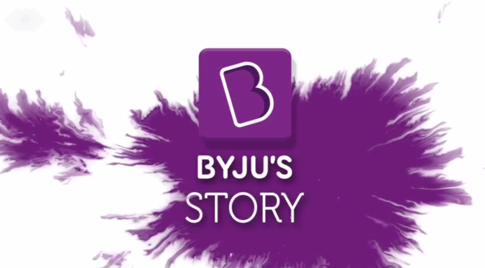
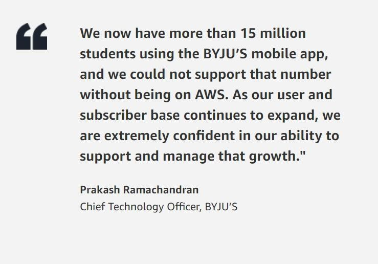
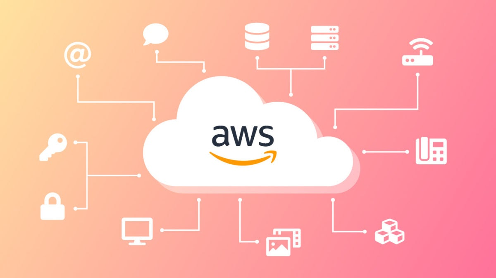
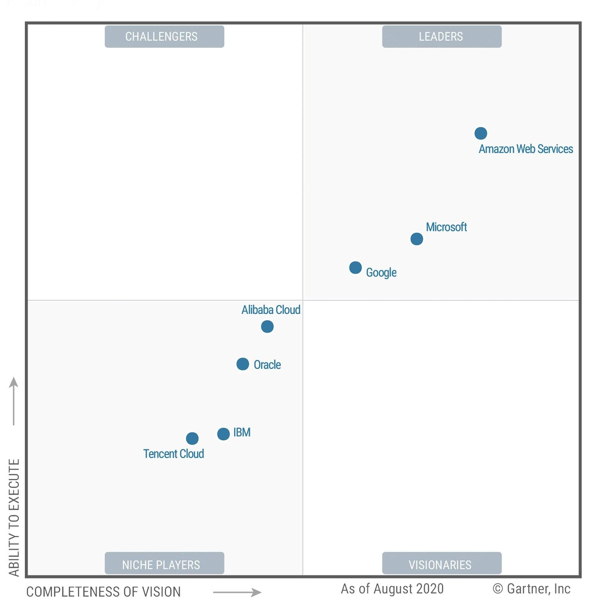
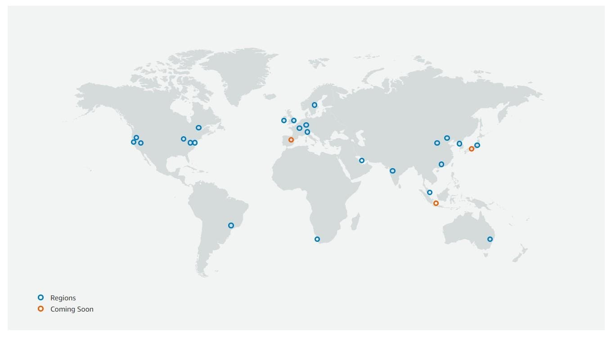

# ***AWS:BYJU’s case study***  

***BYJU'S is India’s largest education company and the creator of India’s most popular learning app, which offers highly adaptive, engaging, and effective learning programs for students.*** 

***In this era of technology how students can get benefited by the mobile devices and rest of the products the company thought about this and came up with the solution*** 

#### ***Just a minute but what is AWS ?..... Let’s See***
#### ***But at the most Lets see what is cloud computing ? …***
#### ***Who is the leading service provider in it? And so on …***

## ***Let’s go***

### ***What is Cloud computing ?***
* ***We often have heard in previous times that many of the companies , top MNC’s require to set up huge infrastructure and need to do a lot of core setup regarding the services they need. Here cloud computing comes into the picture.***
* ***So Cloud computing is the on-demand delivery of IT resources over the Internet***
* ***We can access the services of the cloud, such as computing power, storage, and databases, on an as-needed basis from a cloud providers***

### ***Who is the leading cloud service provider ?***
* ***According to the Garther report AWS is the leading among the rest of the services provided.***
* ***AWS has 24 regions with multiple availability zones And  now 3 more regions are announced. Overall 77 availability zones are there***

* ***More than this AWS offers pay-as-we-go pricing, which enables you to pay only for what you use. Once you stop your usage, there is no fee to terminate, and billing stops immediately. Pay-as-you-go pricing offers you the chance to save over on-premises infrastructure without buying a perpetual software license***

### Now let's come to our case study regarding BYJU’s

### Challenges the company faced Before moving to AWS :

* ***BYJU’s is one of the fastest growing apps which need  a scalable and cost-effective solution according to the chief technology officer at BYJU’S  Prakash Ramachandran When they launched the app, they saw a huge spike in the number of users within a few weeks. So now the demands of these resources grew up and here AWS comes into the Picture. Previously they used  Heroku cloud platform again the platform was not able to keep pace with the growth of the app. But AWS fetch all there requirements***

* ***Moreover they also have the requirement to analyze the data so that they could take  student feedback about the educational content they present on the website and app, so they could make changes if they needed to***

### ***How BYJU’s uses AWS ?***

***BYJU’S runs its website and mobile apps on Amazon Elastic Compute Cloud (Amazon EC2) instances. The company uses Amazon Relational Database Service (Amazon RDS) for PostgreSQL as its primary database service, and it stores presentations and other educational content in Amazon Simple Storage Service (Amazon S3) buckets.***

***For data analytics, BYJU’S takes advantage of the Amazon Redshift fully managed data warehouse to analyze app and website user data through the company’s existing business-intelligence software tools. Using Amazon Redshift, BYJU’S can evaluate student feedback and capitalize on those insights to provide a more personalized learning experience. Now I can discover more accurately how students are actually using their app.  Based on the analysis results, they can directly map learning content to individual students’ needs or preferences.***

### ***Experience with AWS***
***BYJU’S has already proven it can quickly scale to meet spikes in traffic during special online events. Mr. Ramachandran also shared some experience that in an online event they were expecting a fourfold increase in traffic, but what they actually experienced was a tenfold increase, but at that time All they had to do was essentially turn on a switch, and they had more instances on AWS to support the spike. AWS is very fast and simple.***

### ***Lets see how what benefits the company experienced with AWS ?***
#### ***Gaining Better Insights into Student Behavior:***
* ***Using AWS, BYJU’S gains deeper insights into student preferences and app usage, ultimately helping the company create unique, effective, and engaging learning experiences for students across all grades.***
* ***When the company was started, they  didn't have an analytics-processing layer, so it was very difficult for them  to get good analytics about how students use the website and mobile app.***
* ***But Using Amazon Redshift, they  have a robust analytical tool that helps them collect usage data so they can more effectively personalize every student’s learning journey and provide customized feedback and using in-depth analysis.***
* ***For example, BYJU’S is leveraging data analytics on Amazon Redshift to develop guided instructional paths based on student preferences. Now Amazon Redshift is helping them make their content better for each student By analyzing how students view specific features and courses, they can ultimately tailor the content being taught to make it much more effective.***
* ***The company also uses Amazon Redshift to send customized notifications to mobile app users based on courses they have completed***
* ***BYJU’S continues to innovate by making use of newer AWS services to develop solutions. As an example, the organization recently launched a product in India that takes advantage of the Amazon Alexa intelligent personal assistant to deliver audio-based educational content on the Amazon Echo device.***

* ***Using Alexa voice commands, students can find out additional information about a given topic or play educational videos or games within the BYJU’S app***

## ***Like this AWS have Many of the stories of its customers Satisfied with it you can check them out too [here](https://aws.amazon.com/solutions/?nc2=h_ql_sol)***  

### ***Thankyou For Reading : )***

### ***Any query and suggestion are always welcome - [Gaurav Pagare](https://www.linkedin.com/in/pagare-gaurav/)***
